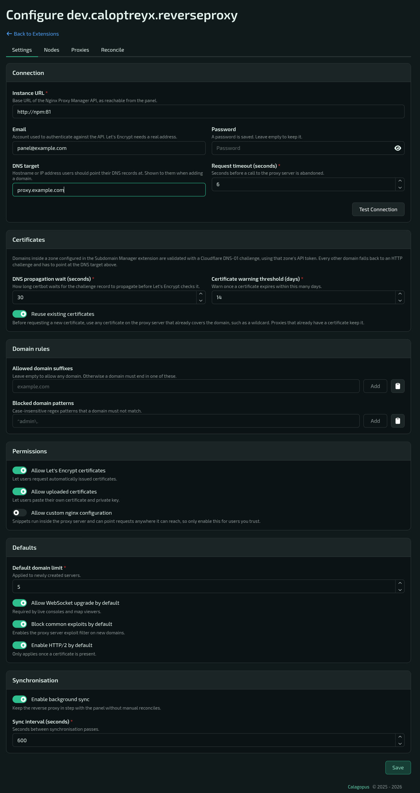

# Reverse Proxy Manager

A [Calagopus Panel](https://calagopus.com) extension that lets users put a domain in front of one
of their server's ports through **Nginx Proxy Manager** or **[NPMplus](https://github.com/ZoeyVid/NPMplus)**,
with automatic **Let's Encrypt** certificates. Users add their own domain (or pick a managed
subdomain), choose a port, done.

Package name: `dev.caloptreyx.reverseproxy` · Requires panel `>=1.2.2` · Tested with Nginx Proxy
Manager 2.15 (2.10+ supported) and NPMplus 2026-07-24-r1 plus its September 2026 development
builds (the flavor is detected automatically)

## What your users get

- Custom domains or managed subdomains, pointed at any of the server's allocations
- Automatic HTTPS with Let's Encrypt, their own uploaded certificate, or plain HTTP only
- WebSockets, caching, HTTP/2, HSTS, force-HTTPS and exploit blocking per proxy
- Optional custom nginx snippets (admin opt-in)
- Clear status at a glance - *live*, *issuing*, *waiting for DNS* or *failed* with a readable reason
- Retry themselves instead of opening a ticket

## What you get

- Per-server proxy limit (`feature_limits.proxies`), allowed domain suffixes and blocked patterns
- Granular permissions and full activity logging
- Fleet view of every proxy across every server, with a failing count
- Reconcile tool to spot and fix drift between the panel and the proxy
- Per-node forward host overrides for NAT'd nodes
- Let's Encrypt rate-limit protection: DNS is checked before a certificate is requested, attempts
  are capped (10 per hour, 3 per domain per week), failures back off, and existing certificates
  (including wildcards) can be reused - so bad DNS can't burn your quota
- Never touches proxy hosts or certificates it doesn't own: every host it creates carries an
  ownership marker that is checked before any change

## Automated

- A background worker issues certificates one at a time and retries with backoff
- A background sync keeps the proxy in step with the panel, fixes drift, tracks certificate
  expiry, renews certificates NPM failed to renew and cleans up orphans it owns
- Deleted servers take their proxies with them; removed ports disable the proxy until a new port
  is chosen; transfers update the forward target
- Remote deletions that fail are queued and retried

## Subdomain Manager integration

With the [Subdomain Manager](https://github.com/Caloptreyx/Subdomain-Manager) extension
installed and enabled, users can create proxies directly on your managed domains. DNS records are
created automatically, Cloudflare zones use DNS-01 validation with the zone's API token, and
reserved names and existing subdomains are respected.

## Installation

Download `dev_caloptreyx_reverseproxy.c7s.zip` from the
[latest release](https://github.com/Caloptreyx/Reverse-Proxy/releases/latest) and either upload it
under **Admin → Extensions** or drop it into your heavy image's `build/extensions/` directory and
`docker compose restart web`. Extensions require the `:heavy` panel image - see the
[Calagopus docs](https://calagopus.com/docs/panel/extensions/installing-extensions).

## Configuration

**Admin → Extensions → Reverse Proxy Manager → Configure**

1. Create a dedicated user in Nginx Proxy Manager with permission to manage proxy hosts and
   certificates. Give it a **real email address** - Let's Encrypt uses it for the account - and
   keep two-factor authentication off for it.
2. Enter the NPM URL as reachable **from the panel** (e.g. `http://npm:81` or a VPN address), the
   user's email and password, and press **Test Connection**.

   **NPMplus:** use an `https://` URL (e.g. `https://npmplus:81`) and turn on **Accept self-signed
   certificate** unless you gave NPMplus a trusted certificate via `DEFAULT_CERT_ID`. New NPMplus
   users start with every permission hidden - set proxy hosts and certificates to *manage* (access
   lists at least *view*). NPMplus registers the Let's Encrypt account with its `ACME_EMAIL`, so
   the user's email doesn't matter. It always enables WebSockets and HTTP/2 and has no caching or
   exploit blocking, so those proxy options have no effect there.
3. Set the **DNS target**: the public IP or hostname of the NPM server. Users are told to point
   their domains here, and HTTP-validated certificates are only requested once a domain resolves
   to it.
4. Give servers a proxy limit (default for new servers in the settings, or per server under
   feature limits).

Tabs:

- **Settings** - connection, certificates, domain rules, user permissions, defaults for new
  proxies and the background sync
- **Nodes** - forward host overrides for nodes behind NAT or on a private network
- **Proxies** - every proxy on the panel, with status filter, retry and delete
- **Reconcile** - compare the panel with NPM and fix drift, plus the queue of pending remote
  deletions

Permissions: server `proxies.read|create|update|delete`, admin `proxies.read|manage`.

### Screenshot

## API

- `GET|POST /api/client/servers/{server}/reverse-proxies`,
  `PATCH|DELETE .../reverse-proxies/{proxy}`, `POST .../reverse-proxies/{proxy}/retry`
- `GET|PUT /api/admin/extensions/dev.caloptreyx.reverseproxy/settings`,
  `POST .../connection/test`
- `GET .../proxies`, `POST .../proxies/{proxy}/retry`, `DELETE .../proxies/{proxy}`
- `GET .../nodes`, `PUT .../nodes/{node}`
- `GET .../reconcile`, `POST .../reconcile/fix`, `GET .../cleanup`, `DELETE .../cleanup/{task}`

Full schemas are in the panel's OpenAPI document once installed.

## Support

Need help or want to request a feature? Join the [Caloptreyx Discord](https://discord.gg/4qjMWU7S8x).

## License

MIT
